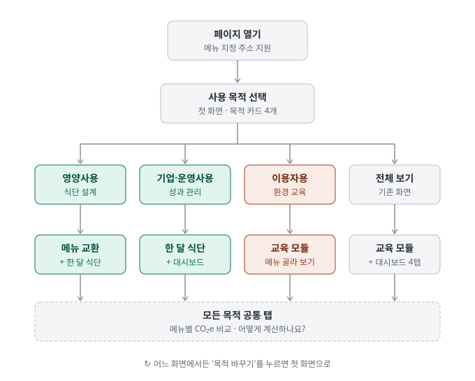
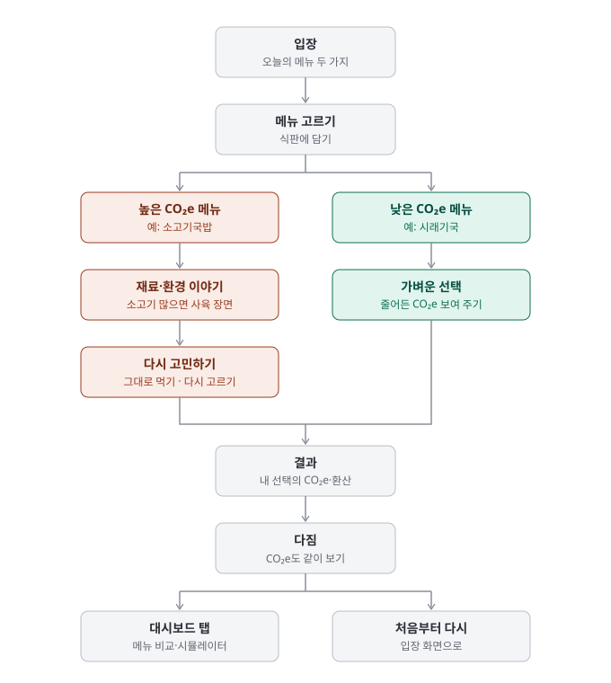
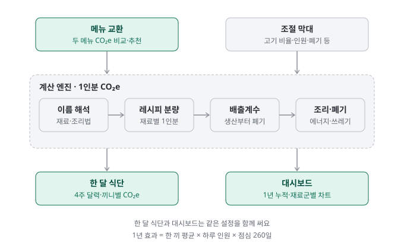

# 지구를 지키는 점심 선택

구내식당 점심 메뉴의 CO₂e(온실가스 배출량)를 메뉴 이름으로 계산해 보여 주는 웹페이지입니다.
첫 화면에서 사용 목적을 고르면 그 목적에 필요한 화면만 열립니다.

다른 학교·기관·회사도 같은 방식으로 만들 수 있도록 코드, 공개 데이터, 제작 문서를 함께 공개합니다.

**[사이트 열기 →](https://andyson114.github.io/pulcourse_new/)**

## 사용 목적별 구성



| 사용 목적 | 대상 | 들어 있는 화면 |
|---|---|---|
| 식단 설계 | 영양사 | 메뉴 교환, 한 달 식단 |
| 성과 관리 | 기업·운영 담당자 | 한 달 식단, 대시보드 |
| 환경 교육 | 식당 이용자 | 교육 모듈 |
| 전체 보기 | 모두 | 교육 모듈 + 대시보드 4개 탭(기존 화면) |

- 모든 목적에서 '메뉴별 CO₂e 비교'와 '어떻게 계산하나요?' 탭을 함께 볼 수 있습니다.
- 어느 화면에서든 '목적 바꾸기'를 누르면 첫 화면으로 돌아갑니다.

## 이용자용 교육 흐름



- CO₂e가 높은 메뉴를 담으면 재료·환경 이야기가, 낮은 메뉴를 담으면 줄어든 양을 보여 주는 화면이 이어집니다.
- 소 사육 장면은 담은 메뉴의 소고기 비중이 50% 이상일 때만 나옵니다.
- '다시 고르기'를 누르면 메뉴 고르기 화면으로 돌아갑니다.

## 계산 방식



1. 메뉴 이름을 재료와 조리법으로 나눕니다. (예: 소고기국밥 → 소고기 · 국밥)
2. 기존 식단 데이터의 레시피에서 재료별 1인분 분량을 가져옵니다.
3. 재료 1kg당 배출계수(생산·가공·유통·폐기)를 곱합니다.
4. 조리 에너지와 음식물 쓰레기 처리 배출을 더합니다.
5. 1인분 값에 하루 이용자 수와 점심 일수(52주 × 5일 = 260일)를 곱해 1년 효과를 구합니다.

한 달 식단과 대시보드는 같은 조절 막대 설정을 함께 씁니다. 한쪽에서 바꾸면 다른 쪽에도 그대로 반영됩니다.

## 오늘의 메뉴를 지정해서 열기

주소 뒤에 메뉴 이름을 붙이면 교육 모듈에 나오는 두 메뉴를 바꿀 수 있습니다.

```
https://andyson114.github.io/pulcourse_new/?a=김치볶음밥&b=순두부찌개&d=9월%2021일
```

- `a`, `b`: 메뉴 이름 두 개. 순서는 상관없고, CO₂e가 높은 쪽이 자동으로 첫 번째 메뉴가 됩니다.
- `d`: 입장 화면에 보일 날짜 문구(선택).
- 데이터에서 찾을 수 없는 이름이면 기본 메뉴(소고기국밥, 시래기국)로 열립니다.

## 공개 자료

| 자료 | 위치 | 내용 |
|---|---|---|
| 제작 가이드 | [docs/BUILD_GUIDE.md](docs/BUILD_GUIDE.md) | 파일 구조, 풀기·고치기·다시 묶기, 내 식당 데이터로 바꾸기, 배포 |
| 데이터 설명서 | [docs/DATA.md](docs/DATA.md) | 계산 데이터 항목별 구조·단위·공개 범위, 내 데이터로 채우는 법 |
| 계산 방법 | [docs/METHODOLOGY.md](docs/METHODOLOGY.md) | 1인분 CO₂e와 1년 효과를 구하는 식, 한계, 출처 |
| 공개 데이터 | [data/](data/) | 재료 130종 배출계수(JSON·CSV), 계산 파라미터 19개, 출처 12개, 메뉴 이름 해석 사전 |
| 소스 | [src/build/](src/build/) · [src/readable/](src/readable/) | 앱을 푼 조각(뼈대·코드·글꼴·그림)과 읽기용 코드 |
| 도구 | [tools/](tools/) | 풀기(`unpack.py`), 묶기(`pack.py`), 비교(`verify.py`), 공개 데이터 내보내기(`export_public_data.py`) |

배출계수 표는 엑셀에서 바로 열 수 있습니다: [data/emission_factors.csv](data/emission_factors.csv)

## 직접 만들어 보기

Python 3만 있으면 됩니다(추가 설치 없음).

```bash
# 1. 조각을 고친 뒤 다시 묶기 (계산 데이터는 직접 준비한 파일을 지정)
python3 tools/pack.py src/build index.html --payload my_payload.json

# 2. 이전 파일과 비교해 바뀐 조각만 확인
python3 tools/verify.py before.html index.html
```

계산 데이터 가운데 레시피 분량처럼 공개하지 않은 부분은 직접 준비해야 합니다. 필요한 형식과 최소 구성은 [데이터 설명서](docs/DATA.md)에, 전체 순서는 [제작 가이드](docs/BUILD_GUIDE.md)에 있습니다.

## 데이터 공개 범위

| 구분 | 항목 | 출처 |
|---|---|---|
| 공개 | 배출계수, 계산 파라미터, 출처 목록, 메뉴 이름 해석 규칙·사전 | 논문·국가 통계·IPCC 등 공개 자료(S001~S011)와 팀이 만든 규칙 |
| 비공개 | 레시피 분량 분포, 조리법별 템플릿, 메뉴 빈도, 연령·기관별 분량 배율, 제품명 단어 | 급식회사 내부 조리지침서(S012) |

비공개 항목은 파일로 내보내지 않았고, 구조만 [데이터 설명서](docs/DATA.md)에서 설명합니다.

## 라이선스

| 대상 | 조건 |
|---|---|
| 코드 (`index.html`의 스크립트, `src/`, `tools/`) | [MIT](LICENSE) |
| 데이터·문서 (`data/`, `docs/`) | [CC BY 4.0](LICENSE-DATA.md) — 출처를 밝히면 자유롭게 사용 |
| 글꼴 (Noto Sans KR) | [SIL OFL 1.1](src/build/fonts/OFL.txt) |
| 기관·기업 로고 | 각 소유자의 표장으로 라이선스 대상 아님 |

원출처 자료의 이용 조건과 그림·로고 정보는 [NOTICE.md](NOTICE.md)에 있습니다.

## 파일 구성

```
index.html              앱 전체(단일 파일) — GitHub Pages로 배포
docs/                   제작 가이드·데이터 설명서·계산 방법, 흐름도(SVG)
data/                   공개 데이터(JSON·CSV)와 목록(MANIFEST.json)
src/build/              index.html을 푼 조각(뼈대·코드·글꼴·그림)
src/readable/           읽기용 코드(engine·dash·app)
tools/                  풀기·묶기·비교·데이터 내보내기 도구
LICENSE, LICENSE-DATA.md, NOTICE.md
```
